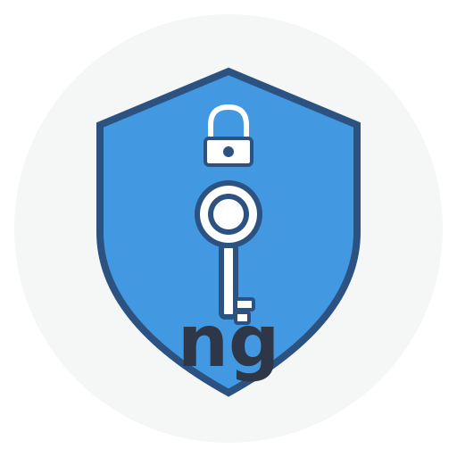

<div align="center">
  
  
  # ngauth
  
  **Lightweight OAuth 2.0 & OpenID Connect Server**
  
  Perfect for testing and development environments
  
  [](LICENSE)
  
  [](https://github.com/ngauth/server)
  [](https://hub.docker.com/r/ngauth/server)
  [](https://github.com/ngauth/server/releases)
  [](https://testcontainers.com/)
  
</div>

---

## 🚀 Quick Start

Get ngauth running in seconds with Docker:

```bash
# Pull and run the container
docker run -d -p 3000:3000 ngauth/server

# Or use Docker Compose
docker-compose up -d
```

**That's it!** Your OAuth 2.0 server is now running at `http://localhost:3000`

For testing with Testcontainers (recommended for integration tests):

```javascript
// Node.js example
const { GenericContainer } = require('testcontainers');

const container = await new GenericContainer('ngauth/server')
  .withExposedPorts(3000)
  .start();

const serverUrl = `http://${container.getHost()}:${container.getMappedPort(3000)}`;
// Start testing!
```

📖 [See full Testcontainers guide](docs/TESTCONTAINERS.md)

---

## 💡 Why ngauth?

**ngauth** is designed specifically for **development and testing** environments where you need a real OAuth 2.0/OIDC server without the complexity of production-grade solutions.

### Key Benefits

✅ **Zero Configuration** - Works out of the box with sensible defaults  
✅ **Lightweight** - Docker image < 100MB, starts in seconds  
✅ **Standards Compliant** - Implements OAuth 2.0 (RFC 6749) and OpenID Connect Core  
✅ **Test-Friendly** - Built for Testcontainers and automated testing  
✅ **No External Dependencies** - Fully self-contained, no database required  
✅ **Predictable Data** - Pre-seeded with test users and clients  
✅ **Developer Experience** - Simple API, clear documentation, easy debugging  

### Comparison

| Feature | ngauth | Keycloak | WireMock |
|---------|--------|----------|----------|
| **Purpose** | OAuth testing | Production IAM | HTTP mocking |
| **Startup Time** | < 3 seconds | 30-60 seconds | < 1 second |
| **Memory Usage** | ~50 MB | ~1 GB | ~100 MB |
| **Configuration** | Zero config | Complex | Manual setup |
| **OAuth 2.0 Support** | ✅ Full | ✅ Full | ⚠️ Manual mocks |
| **OIDC Support** | ✅ Full | ✅ Full | ⚠️ Manual mocks |
| **Docker Image Size** | ~80 MB | ~600 MB | ~150 MB |
| **Testcontainers** | ✅ Optimized | ✅ Slow | ❌ Not designed |
| **Learning Curve** | Minimal | Steep | Medium |
| **Best For** | Testing/Dev | Production | Generic mocking |

---

## 🎯 Use Cases

### Integration Testing
Perfect for testing applications that integrate with OAuth providers:
- Verify OAuth flows (authorization code, client credentials, etc.)
- Test token validation and JWT verification
- Validate error handling and edge cases
- No need for external services or API keys

### CI/CD Pipelines
Ideal for automated testing in CI environments:
- Fast startup times don't slow down builds
- Deterministic behavior ensures reliable tests
- No external dependencies or rate limits
- Works offline once image is cached

### Local Development
Great for developing OAuth-integrated applications:
- No internet connection required
- Consistent test data across team members
- Easy debugging with predictable responses
- Faster than hitting real OAuth providers

### Training & Education
Excellent for learning OAuth 2.0 and OIDC:
- See real OAuth flows in action
- Experiment without production concerns
- Clear, understandable codebase
- Standard-compliant implementation

---

## 📚 Documentation

- [Quick Start Guide (OIDC)](docs/QUICKSTART_OIDC.md) - Get started with OpenID Connect
- [OpenID Connect Details](docs/OIDC.md) - Complete OIDC implementation guide
- [Testcontainers Usage](docs/TESTCONTAINERS.md) - Integration testing examples
- [Branding Guidelines](docs/BRANDING.md) - Logo and visual assets
- [Sample Applications](docs/samples/README.md) - Example implementations

---

## 🐳 Docker Usage

### Pull from Docker Hub

```bash
docker pull ngauth/server:latest
```

### Run with Custom Configuration

```bash
docker run -d \
  -p 3000:3000 \
  -e NODE_ENV=production \
  -v $(pwd)/data:/app/data \
  ngauth/server
```

### Docker Compose

```yaml
version: '3.8'
services:
  ngauth:
    image: ngauth/server:latest
    ports:
      - "3000:3000"
    environment:
      - NODE_ENV=development
    volumes:
      - ./data:/app/data
```

---

## 🎭 Provider Presets

**ngauth can mimic popular OAuth providers** for realistic testing! Test your application against different OAuth server behaviors without running the actual services.

### Available Presets

```bash
# Mimic Auth0
docker run -e NGAUTH_PRESET=auth0 -p 3000:3000 ngauth/server

# Mimic Okta  
docker run -e NGAUTH_PRESET=okta -p 3000:3000 ngauth/server

# Mimic Azure AD B2C
docker run -e NGAUTH_PRESET=azureb2c -p 3000:3000 ngauth/server

# Mimic Microsoft Entra ID
docker run -e NGAUTH_PRESET=entraid -p 3000:3000 ngauth/server

# Mimic Keycloak
docker run -e NGAUTH_PRESET=keycloak -p 3000:3000 ngauth/server

# Mimic Duende IdentityServer
docker run -e NGAUTH_PRESET=identityserver -p 3000:3000 ngauth/server

# Mimic Google Identity Platform
docker run -e NGAUTH_PRESET=google -p 3000:3000 ngauth/server

# Mimic AWS Cognito
docker run -e NGAUTH_PRESET=cognito -p 3000:3000 ngauth/server
```

### What Each Preset Configures

Each preset automatically sets up:
- ✅ **Endpoint paths** - Match the exact URLs of the real provider
- ✅ **Claim structure** - Use provider-specific claim names and formats
- ✅ **Token lifetimes** - Realistic TTL values
- ✅ **Scopes and roles** - Provider-specific claim patterns

| Preset | Scope Claim | Format | Roles/Groups | Special Features |
|--------|-------------|--------|--------------|------------------|
| **auth0** | `scope` | String | `permissions` array | Namespaced claims |
| **okta** | `scp` | Array | `groups` array | No separate roles |
| **azureb2c** | `scp` | String | `roles` array | Azure-style GUIDs |
| **entraid** | `scp` | String | `roles`/`groups` array | Microsoft identity platform v2.0 |
| **keycloak** | `scope` | String | `realm_access.roles` | Hierarchical roles |
| **identityserver** | `scope` | String | `role` array | Clean claim names |
| **google** | `scope` | String | None | Minimal claims |
| **cognito** | `scope` | String | `cognito:groups` | AWS-prefixed claims |

### Example: Test Your App with Multiple Providers

```javascript
// Test that your app works with different OAuth providers
const providers = ['auth0', 'okta', 'azureb2c', 'keycloak'];

describe.each(providers)('OAuth Provider: %s', (preset) => {
  let container;
  
  beforeAll(async () => {
    container = await new GenericContainer('ngauth/server')
      .withExposedPorts(3000)
      .withEnvironment('NGAUTH_PRESET', preset)
      .start();
  });
  
  it('should authenticate successfully', async () => {
    // Your test code - works with all providers!
  });
});
```

### Fine-Tune with Environment Variables

Override specific settings while using a preset:

```bash
# Use Auth0 preset but with custom token TTL
docker run \
  -e NGAUTH_PRESET=auth0 \
  -e NGAUTH_ACCESS_TOKEN_TTL=7200 \
  -p 3000:3000 \
  ngauth/server
```

**Advanced Configuration:** See [Configuration Reference](#-configuration) for all available environment variables.

---

## 🧪 Testing with Testcontainers

ngauth is optimized for use with [Testcontainers](https://testcontainers.com/), making it perfect for integration testing in any language.

**Supported Languages:**
- ✅ Node.js / JavaScript / TypeScript
- ✅ Java / Kotlin
- ✅ Python
- ✅ Go
- ✅ .NET / C#

See the [Testcontainers Guide](docs/TESTCONTAINERS.md) for complete examples.

---

## 🔧 Features

### OAuth 2.0 Support
- Authorization Code Flow
- Client Credentials Flow
- Implicit Flow (legacy support)
- Token refresh
- Token revocation

### OpenID Connect Support
- ID Tokens with JWT
- UserInfo endpoint
- Discovery endpoint (/.well-known/openid-configuration)
- JWKS endpoint for public key distribution
- Standard claims (sub, email, name, etc.)

### Security Features
- JWT token signing (RS256)
- Token validation
- Client authentication
- Rate limiting
- CSRF protection
- Audit logging

### Developer Features
- Health check endpoint
- Pre-seeded test data
- Clear error messages
- Request/response logging
- Configurable token lifetimes

---

## 📦 Installation

### Option 1: Docker (Recommended)

```bash
docker pull ngauth/server:latest
docker run -p 3000:3000 ngauth/server
```

### Option 2: From Source

```bash
git clone https://github.com/ngauth/server.git
cd server
npm install
npm start
```

---

## �️ Configuration

ngauth works with zero configuration but can be customized via environment variables.

### Quick Configuration with Presets

Use `NGAUTH_PRESET` to instantly configure ngauth to match popular OAuth providers:

```bash
NGAUTH_PRESET=auth0        # Auth0
NGAUTH_PRESET=okta         # Okta
NGAUTH_PRESET=azureb2c     # Azure AD B2C
NGAUTH_PRESET=keycloak     # Keycloak
NGAUTH_PRESET=identityserver  # Duende IdentityServer
NGAUTH_PRESET=google       # Google
NGAUTH_PRESET=cognito      # AWS Cognito
NGAUTH_PRESET=custom       # Manual configuration (default)
```

### Advanced Environment Variables

Override preset settings or configure manually:

#### General Settings
```bash
PORT=3000                          # Server port
NGAUTH_ISSUER=http://localhost:3000  # OAuth issuer URL
NGAUTH_DATA=/app/data              # Data directory
```

#### Endpoint Paths
```bash
NGAUTH_AUTHORIZE_PATH=/authorize
NGAUTH_TOKEN_PATH=/token
NGAUTH_JWKS_PATH=/.well-known/jwks.json
NGAUTH_OIDC_PATH=/.well-known/openid-configuration
NGAUTH_USERINFO_PATH=/userinfo
NGAUTH_INTROSPECT_PATH=/introspect
NGAUTH_REVOKE_PATH=/revoke
NGAUTH_LOGOUT_PATH=/logout
```

#### Claim Configuration
```bash
NGAUTH_SCOPE_CLAIM_NAME=scope      # Claim name for scopes
NGAUTH_SCOPE_FORMAT=string         # "string" or "array"
NGAUTH_ROLES_CLAIM_NAME=roles      # Claim name for roles
NGAUTH_GROUPS_CLAIM_NAME=groups    # Claim name for groups
NGAUTH_PERMISSIONS_CLAIM_NAME=permissions  # Claim name for permissions
NGAUTH_REQUIRE_NAMESPACED_CLAIMS=false     # Auth0-style namespacing
NGAUTH_NAMESPACE_PREFIX=https://myapp.com  # Namespace prefix
```

#### Token Settings
```bash
NGAUTH_ACCESS_TOKEN_TTL=3600       # Access token lifetime (seconds)
NGAUTH_ID_TOKEN_TTL=3600           # ID token lifetime (seconds)
NGAUTH_REFRESH_TOKEN_TTL=86400     # Refresh token lifetime (seconds)
NGAUTH_TOKEN_SIGNING_ALG=RS256     # Signing algorithm
```

#### Feature Flags
```bash
NGAUTH_SUPPORT_PKCE=true           # Enable PKCE support
NGAUTH_SUPPORT_REFRESH_TOKENS=true # Enable refresh tokens
NGAUTH_SUPPORT_OFFLINE_ACCESS=true # Enable offline_access scope
```

### Example Configurations

#### Docker Compose with Auth0 Preset
```yaml
version: '3.8'
services:
  oauth:
    image: ngauth/server:latest
    ports:
      - "3000:3000"
    environment:
      NGAUTH_PRESET: auth0
      NGAUTH_ACCESS_TOKEN_TTL: 7200
```

#### Testcontainers with Keycloak Preset
```javascript
const container = await new GenericContainer('ngauth/server')
  .withExposedPorts(3000)
  .withEnvironment('NGAUTH_PRESET', 'keycloak')
  .withEnvironment('NGAUTH_ACCESS_TOKEN_TTL', '300')
  .start();
```

#### Custom Configuration (No Preset)
```bash
docker run \
  -e NGAUTH_PRESET=custom \
  -e NGAUTH_AUTHORIZE_PATH=/custom/authorize \
  -e NGAUTH_TOKEN_PATH=/custom/token \
  -e NGAUTH_SCOPE_CLAIM_NAME=custom_scope \
  -e NGAUTH_SCOPE_FORMAT=array \
  -p 3000:3000 \
  ngauth/server
```

---

## �🔑 Pre-configured Test Data

ngauth comes with pre-seeded data for immediate testing:

### Test Users
- **Username:** `testuser` / **Password:** `password123`
- **Username:** `alice` / **Password:** `alice123`
- **Username:** `bob` / **Password:** `bob123`

### Test Clients
- **Client ID:** `test-client`
- **Client Secret:** `test-secret`
- **Redirect URI:** `http://localhost:3000/callback`

---

## 🛠️ Configuration

ngauth works with zero configuration but can be customized:

### Environment Variables

```bash
PORT=3000                    # Server port
NODE_ENV=development         # Environment mode
JWT_EXPIRATION=3600          # Access token lifetime (seconds)
REFRESH_EXPIRATION=86400     # Refresh token lifetime (seconds)
```

### Data Persistence

By default, data is stored in JSON files in `/app/data`:
- `users.json` - User accounts
- `clients.json` - OAuth clients
- `codes.json` - Authorization codes (temporary)

Mount a volume to persist data:

```bash
docker run -v ./my-data:/app/data ngauth/server
```

---

## 📖 API Endpoints

### OAuth 2.0 / OIDC Endpoints

| Endpoint | Description |
|----------|-------------|
| `GET /authorize` | Authorization endpoint |
| `POST /token` | Token endpoint |
| `GET /userinfo` | UserInfo endpoint (OIDC) |
| `GET /.well-known/openid-configuration` | OIDC Discovery |
| `GET /.well-known/jwks.json` | JWKS public keys |

### Management Endpoints

| Endpoint | Description |
|----------|-------------|
| `GET /health` | Health check |
| `POST /users` | Create user (testing only) |
| `POST /register` | Register OAuth client |

See [full API documentation](docs/OIDC.md) for details.

---

## 🤝 Contributing

Contributions are welcome! Please feel free to submit a Pull Request.

---

## 📄 License

This project is licensed under the MIT License - see the [LICENSE](LICENSE) file for details.

---

## 🌟 Star History

If you find ngauth useful, please consider giving it a star on GitHub!

---

## 📞 Support

- 📫 [Open an issue](https://github.com/ngauth/server/issues)
- 💬 [Discussions](https://github.com/ngauth/server/discussions)
- 📖 [Documentation](docs/)

---

<div align="center">
  
**Built for developers, by developers** 🚀

[GitHub](https://github.com/ngauth/server) • [Docker Hub](https://hub.docker.com/r/ngauth/server) • [Testcontainers](https://testcontainers.com/)

</div>
