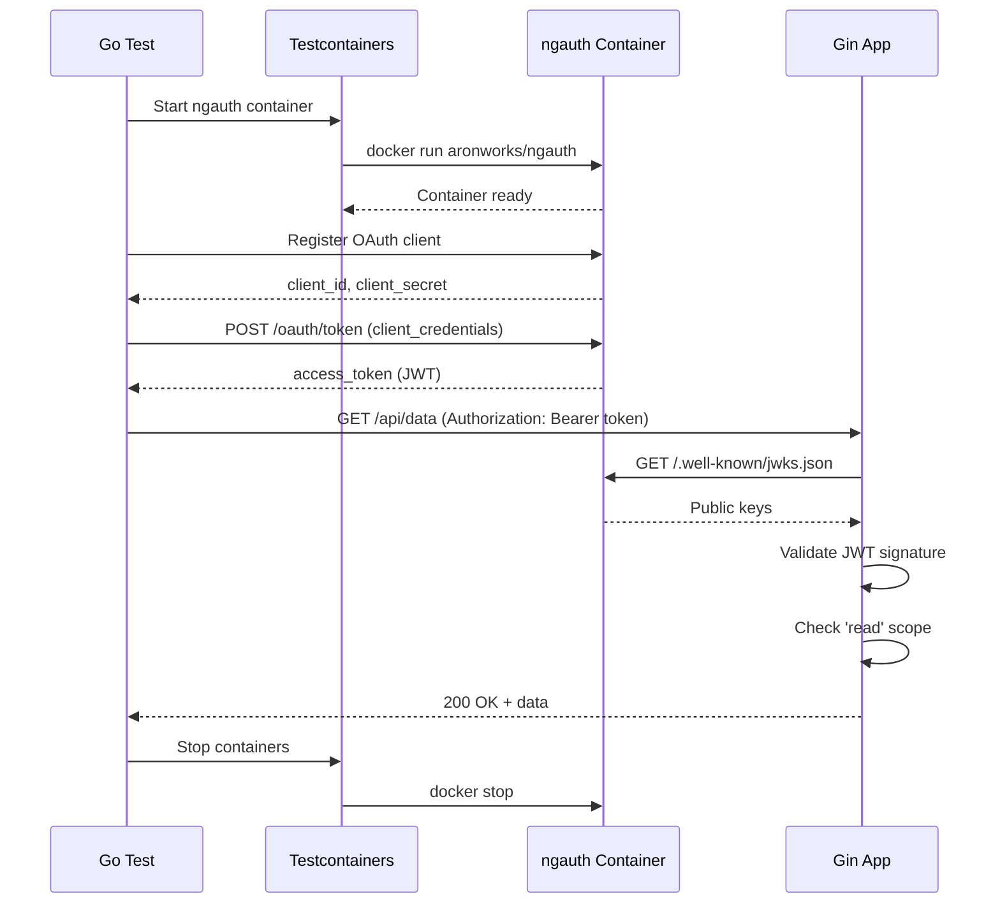

# Testcontainers Go Example - ngauth OAuth Server

This example demonstrates how to use [Testcontainers](https://testcontainers.com/) to test a Go Gin application that integrates with the ngauth OAuth 2.0 + OpenID Connect server.

## Overview

This sample includes:
- A **Gin REST API** (`main.go`) with endpoints protected by OAuth 2.0 JWT tokens
- **Go tests** (`main_test.go`) that use Testcontainers to spin up the ngauth OAuth server
- Scope-based authorization (`read`, `write` scopes)
- JWT validation using JWKS (JSON Web Key Set)

## API Endpoints

| Endpoint | Method | Auth Required | Scope Required | Description |
|----------|--------|---------------|----------------|-------------|
| `/api/public` | GET | No | - | Public endpoint |
| `/api/protected` | GET | Yes | - | Requires valid JWT |
| `/api/data` | GET | Yes | `read` | Retrieve data |
| `/api/data` | POST | Yes | `write` | Create data |
| `/api/userinfo` | GET | Yes | - | Get user claims from JWT |
| `/health` | GET | No | - | Health check |

## Prerequisites

- Go 1.21 or later
- Docker installed and running

## Installation

1. Initialize Go module and download dependencies:

```bash
go mod download
```

## Running the API

Start the API server locally:

```bash
# Set the OAuth issuer URL (required)
export OAUTH_ISSUER=http://localhost:3000

# Run the Gin server
go run main.go
```

The API will be available at `http://localhost:8000`.

You can test it manually:

```bash
# Access public endpoint
curl http://localhost:8000/api/public

# Access protected endpoint (will fail without token)
curl http://localhost:8000/api/protected
```

## Running Tests

The tests use Testcontainers to automatically:
1. Start the ngauth OAuth server in a Docker container
2. Register an OAuth client
3. Obtain access tokens
4. Test API endpoints with proper authentication
5. Clean up containers after tests complete

Run all tests:

```bash
go test -v
```

Run specific test:

```bash
go test -v -run TestProtectedEndpointWithAuth
```

Run tests with coverage:

```bash
go test -v -coverprofile=coverage.out
go tool cover -html=coverage.out
```

## What the Tests Cover

The test suite validates:

- ✅ **Public endpoint** - Accessible without authentication
- ✅ **Protected endpoint** - Requires valid JWT token
- ✅ **Scope enforcement** - `read` scope for GET, `write` scope for POST
- ✅ **JWT validation** - Verifies token signature using JWKS
- ✅ **Scope rejection** - Denies access with insufficient scopes
- ✅ **User info** - Returns JWT claims from authenticated requests
- ✅ **OIDC Discovery** - Validates OAuth metadata endpoint
- ✅ **JWKS endpoint** - Validates public key retrieval

## Test Flow



## Project Structure

```
testcontainers-go/
├── main.go          # Gin application with OAuth protection
├── main_test.go     # Go tests using Testcontainers
├── go.mod           # Go module dependencies
├── go.sum           # Dependency checksums (generated)
└── README.md        # This file
```

## Key Dependencies

- **gin-gonic/gin** - High-performance web framework
- **golang-jwt/jwt** - JWT implementation for Go
- **lestrrat-go/jwx** - JWK/JWKS support with key caching
- **testcontainers-go** - Docker container management for tests
- **stretchr/testify** - Test assertions and utilities

## How It Works

### JWT Validation

The API validates JWT tokens by:
1. Fetching the JWKS (JSON Web Key Set) from ngauth's `/.well-known/jwks.json` endpoint
2. Caching the JWKS for performance
3. Extracting the signing key based on the token's `kid` (key ID) header
4. Verifying the token signature using RS256 algorithm
5. Checking token expiration and other claims

```go
// Fetch and cache JWKS
jwksCache, err := jwk.Parse(resp.Body)

// Find key by ID
key, found := jwksCache.LookupKeyID(kid)

// Parse and validate token
token, err := jwt.Parse(tokenString, func(token *jwt.Token) (interface{}, error) {
    // Return RSA public key from JWKS
    return rsaKey, nil
})
```

### Scope-Based Authorization

The API uses Gin middleware to enforce scopes:

```go
func RequireScope(requiredScope string) gin.HandlerFunc {
    return func(c *gin.Context) {
        claims := c.MustGet("claims").(jwt.MapClaims)
        scope := claims["scope"].(string)
        scopes := strings.Split(scope, " ")
        
        if !contains(scopes, requiredScope) {
            c.JSON(http.StatusForbidden, gin.H{"error": "Insufficient scope"})
            c.Abort()
            return
        }
        c.Next()
    }
}

// Apply middleware
api.GET("/data", AuthMiddleware(), RequireScope("read"), handler)
```

## Troubleshooting

**Tests fail with "Container not ready":**
- Ensure Docker is running: `docker ps`
- Check Docker image is available: `docker pull aronworks/ngauth:latest`
- Increase wait timeout in test setup if needed

**JWT validation fails:**
- Verify `OAUTH_ISSUER` environment variable is set correctly
- Check ngauth container is accessible at the issuer URL
- Ensure JWKS endpoint returns valid keys: `curl http://localhost:3000/.well-known/jwks.json`

**Port conflicts:**
- Tests use dynamic port mapping, but if issues persist, check for processes using ports 3000 or 8000
- Kill processes: `lsof -ti:3000 | xargs kill -9`

**Go module issues:**
- Run `go mod tidy` to clean up dependencies
- Run `go mod download` to fetch all dependencies
- Check Go version: `go version` (requires 1.21+)

## Learn More

- [ngauth Documentation](https://github.com/yourusername/ngauth)
- [Testcontainers Go](https://golang.testcontainers.org/)
- [Gin Web Framework](https://gin-gonic.com/)
- [OAuth 2.0 RFC 6749](https://tools.ietf.org/html/rfc6749)
- [OpenID Connect Core 1.0](https://openid.net/specs/openid-connect-core-1_0.html)

## License

This example is licensed under the MIT License.
