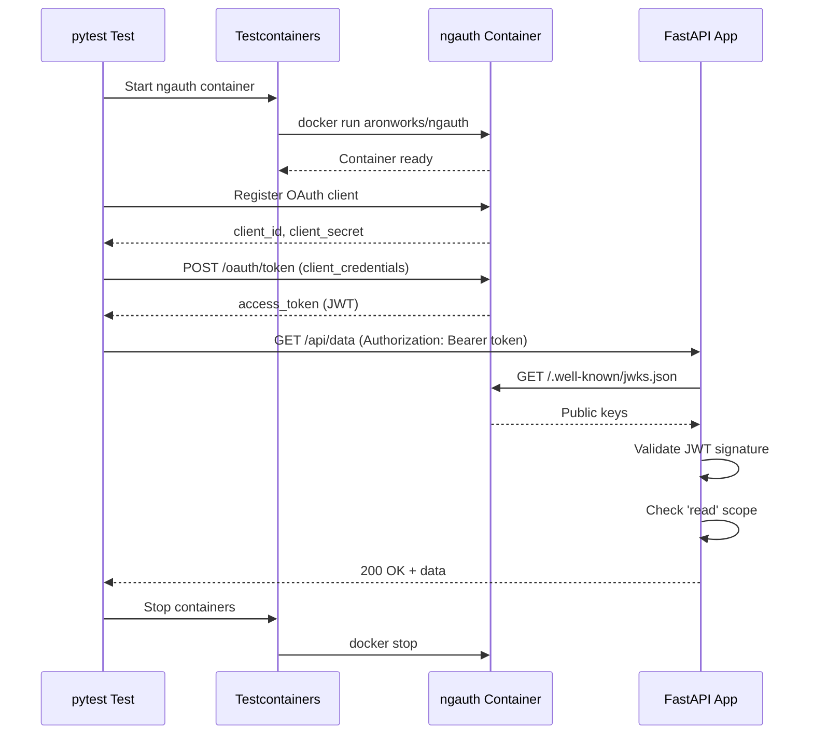

# Testcontainers Python Example - ngauth OAuth Server

This example demonstrates how to use [Testcontainers](https://testcontainers.com/) to test a Python FastAPI application that integrates with the ngauth OAuth 2.0 + OpenID Connect server.

## Overview

This sample includes:
- A **FastAPI REST API** (`api.py`) with endpoints protected by OAuth 2.0 JWT tokens
- **pytest tests** (`test_api.py`) that use Testcontainers to spin up the ngauth OAuth server
- Scope-based authorization (`read`, `write` scopes)
- JWT validation using JWKS (JSON Web Key Set)

## API Endpoints

| Endpoint | Method | Auth Required | Scope Required | Description |
|----------|--------|---------------|----------------|-------------|
| `/api/public` | GET | No | - | Public endpoint |
| `/api/protected` | GET | Yes | - | Requires valid JWT |
| `/api/data` | GET | Yes | `read` | Retrieve data |
| `/api/data` | POST | Yes | `write` | Create data |
| `/api/userinfo` | GET | Yes | - | Get user claims from JWT |
| `/health` | GET | No | - | Health check |

## Prerequisites

- Python 3.11 or later
- Docker installed and running
- pip (Python package manager)

## Installation

1. Install dependencies:

```bash
pip install -r requirements.txt
pip install -r requirements-test.txt
```

## Running the API

Start the API server locally:

```bash
# Set the OAuth issuer URL (required)
export OAUTH_ISSUER=http://localhost:3000

# Run the FastAPI server
uvicorn api:app --host 0.0.0.0 --port 8000
```

The API will be available at `http://localhost:8000`.

You can test it manually:

```bash
# Access public endpoint
curl http://localhost:8000/api/public

# Access protected endpoint (will fail without token)
curl http://localhost:8000/api/protected
```

## Running Tests

The tests use Testcontainers to automatically:
1. Start the ngauth OAuth server in a Docker container
2. Register an OAuth client
3. Obtain access tokens
4. Test API endpoints with proper authentication
5. Clean up containers after tests complete

Run all tests:

```bash
pytest test_api.py -v
```

Run specific test:

```bash
pytest test_api.py::test_protected_endpoint_with_token -v
```

## What the Tests Cover

The test suite validates:

- ✅ **Public endpoint** - Accessible without authentication
- ✅ **Protected endpoint** - Requires valid JWT token
- ✅ **Scope enforcement** - `read` scope for GET, `write` scope for POST
- ✅ **JWT validation** - Verifies token signature using JWKS
- ✅ **Scope rejection** - Denies access with insufficient scopes
- ✅ **User info** - Returns JWT claims from authenticated requests
- ✅ **OIDC Discovery** - Validates OAuth metadata endpoint
- ✅ **JWKS endpoint** - Validates public key retrieval

## Test Flow



## Project Structure

```
testcontainers-python/
├── api.py                    # FastAPI application with OAuth protection
├── test_api.py              # pytest tests using Testcontainers
├── requirements.txt         # Production dependencies
├── requirements-test.txt    # Test dependencies
└── README.md               # This file
```

## Key Dependencies

**Production:**
- **FastAPI** - Modern web framework for building APIs
- **PyJWT** - JWT encoding/decoding with JWKS support
- **python-jose** - JWT validation library
- **uvicorn** - ASGI server for FastAPI

**Testing:**
- **pytest** - Testing framework
- **Testcontainers** - Docker container management for tests
- **httpx** - HTTP client for API testing

## How It Works

### JWT Validation

The API validates JWT tokens by:
1. Fetching the JWKS (JSON Web Key Set) from ngauth's `/.well-known/jwks.json` endpoint
2. Extracting the signing key based on the token's `kid` (key ID) header
3. Verifying the token signature using RS256 algorithm
4. Checking token expiration and other claims

```python
jwks_client = PyJWKClient(JWKS_URL)
signing_key = jwks_client.get_signing_key_from_jwt(token)
decoded = jwt.decode(token, signing_key.key, algorithms=["RS256"])
```

### Scope-Based Authorization

The API uses FastAPI's dependency injection to enforce scopes:

```python
def require_scope(required_scope: str):
    def scope_checker(token_data: Dict[str, Any] = Depends(verify_token)):
        token_scope = token_data.get("scope", "")
        scopes = token_scope.split()
        if required_scope not in scopes:
            raise HTTPException(status_code=403)
        return token_data
    return scope_checker

@app.get("/api/data")
async def get_data(token_data = Depends(require_scope("read"))):
    return {"data": ["item1", "item2", "item3"]}
```

## Troubleshooting

**Tests fail with "Container not ready":**
- Ensure Docker is running: `docker ps`
- Check Docker image is available: `docker pull aronworks/ngauth:latest`
- Increase wait time in test fixtures if needed

**JWT validation fails:**
- Verify `OAUTH_ISSUER` environment variable is set correctly
- Check ngauth container is accessible at the issuer URL
- Ensure JWKS endpoint returns valid keys: `curl http://localhost:3000/.well-known/jwks.json`

**Port conflicts:**
- Tests use dynamic port mapping, but if issues persist, check for processes using ports 3000 or 8000
- Kill processes: `lsof -ti:3000 | xargs kill -9`

## Learn More

- [ngauth Documentation](https://github.com/yourusername/ngauth)
- [Testcontainers Python](https://testcontainers-python.readthedocs.io/)
- [FastAPI Documentation](https://fastapi.tiangolo.com/)
- [OAuth 2.0 RFC 6749](https://tools.ietf.org/html/rfc6749)
- [OpenID Connect Core 1.0](https://openid.net/specs/openid-connect-core-1_0.html)

## License

This example is licensed under the MIT License.
